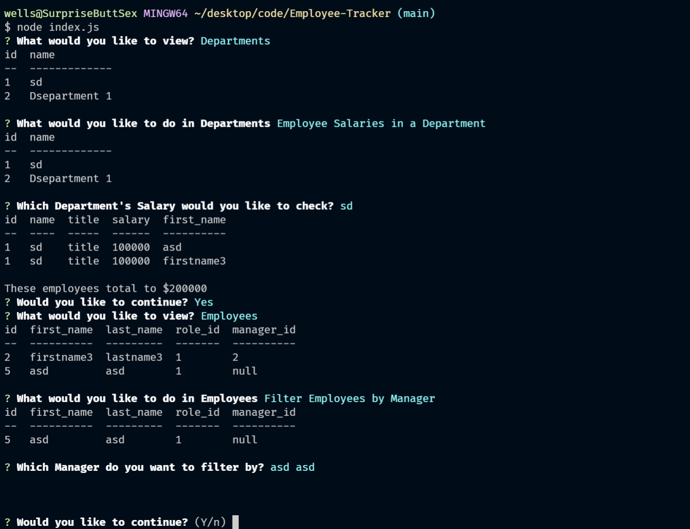

# Employee-Tracker  
  
  
  ## Description:  
  This command-line application allows you to view, add, update, and delete, from a database that stores Employee data.

  ## Table of Contents:  
  - [Description](#-description)
  - [Table of Contents](#-table-of-contents)
  - [Installation](#-installation)
  - [Usage](#-usage)
  - [License](#-license)
  - [Contributing](#-contributing)
  - [Tests](#-tests)
  - [Questions](#-questions)

  ## Installation:  
    1. go to the Github repo. 2. Clone the repo. 3. install the dependencies. 4. Run with: node index.js in the terminal.

  ## Usage:  
  Run the program, interact with prompts to edit employees
  
  ## License:  
  Licensed under [MIT](./LICENSE)
  
  ## Contributing:  
  Me
  
  ## Tests:  
  Track Employee Data

  
  
  ## Questions:  
  Contact Me: [Github](https://gist.github.com/WellsWu4621), or Email Me @wellswu.dev@gmail.com  
  Repository Link [Employee-Tracker](https://github.com/WellsWu4621/Employee-Tracker)

